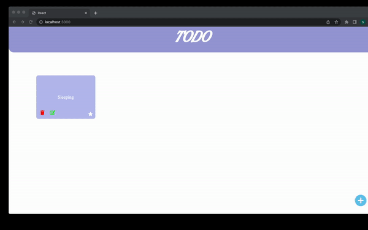

# todoapp_frontend

Using the Todo App's API that you built in the previous topic(Backend) develop a frontend app that maintains TODO. 

Setup a React Application from scratch without using create-react-app(refer the previous section) and build a todo application's frontend. 
Call the relevant APIs for the following tasks - 
Creating a todo
Listing all the existing todos
Updating an already created todo
Deleting a specific todo

